# Галерея / Gallery

Клик по миниатюре открывает файл в полном размере. / Click a thumbnail for the full-size image.

## 3D

[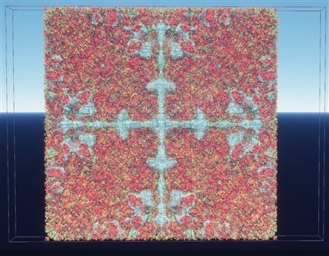](docs/gallery/3d/01.jpg)
[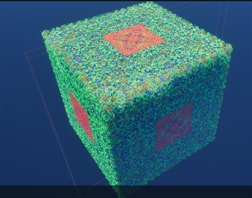](docs/gallery/3d/02.jpg)
[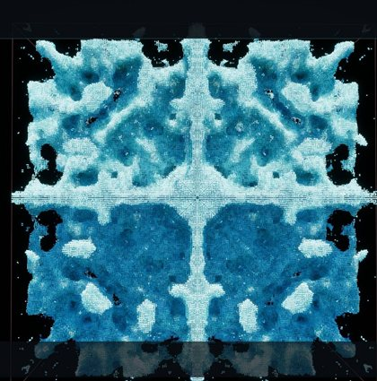](docs/gallery/3d/03.jpg)
[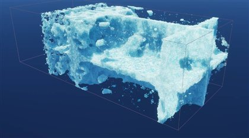](docs/gallery/3d/04.jpg)
[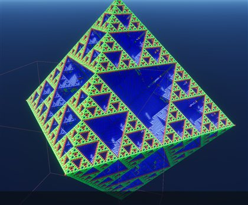](docs/gallery/3d/05.jpg)
[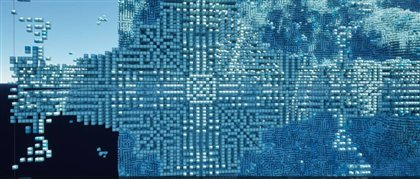](docs/gallery/3d/06.jpg)
[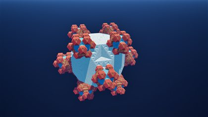](docs/gallery/3d/07.jpg)
[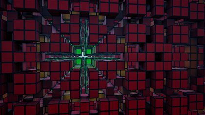](docs/gallery/3d/08.jpg)
[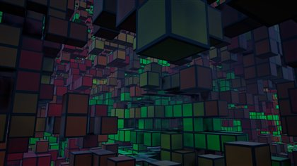](docs/gallery/3d/09.jpg)
[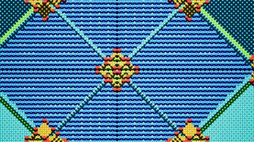](docs/gallery/3d/10.jpg)
[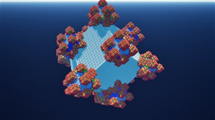](docs/gallery/3d/11.jpg)
[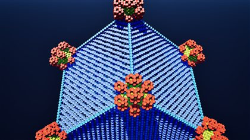](docs/gallery/3d/12.jpg)
[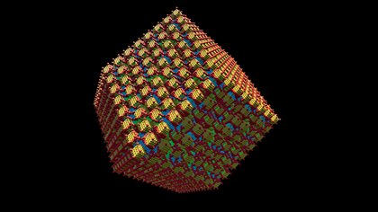](docs/gallery/3d/13.jpg)
[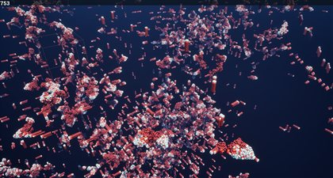](docs/gallery/3d/14.jpg)
[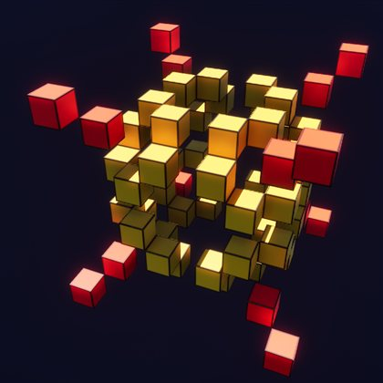](docs/gallery/3d/15.jpg)
[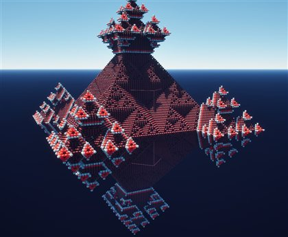](docs/gallery/3d/16.jpg)
[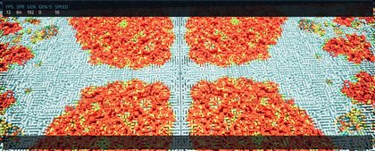](docs/gallery/3d/17.jpg)
[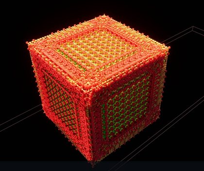](docs/gallery/3d/18.jpg)
[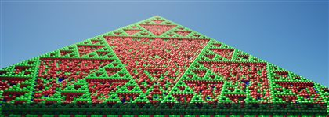](docs/gallery/3d/19.jpg)
[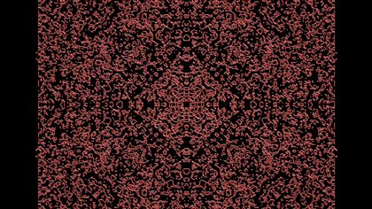](docs/gallery/3d/20.jpg)
[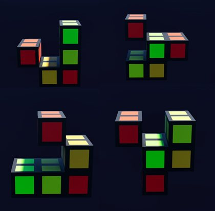](docs/gallery/3d/21.jpg)

*Кадр 21 — клетки крупным планом, цвет кодирует возраст; правило `5-7/6/2/M`. / Frame 21 — cells up close, color encodes age; rule `5-7/6/2/M`.*

## 2D-срезы / 2D slices

Ортогональные PNG-срезы, растеризованные прямо из сетки (F6/F7). / Orthogonal PNG slices rasterized straight from the grid (F6/F7).

[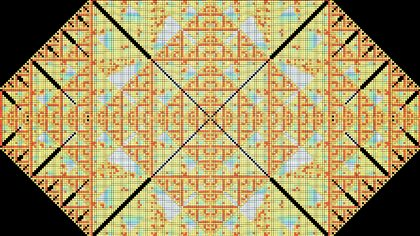](docs/gallery/slices/01.png)
[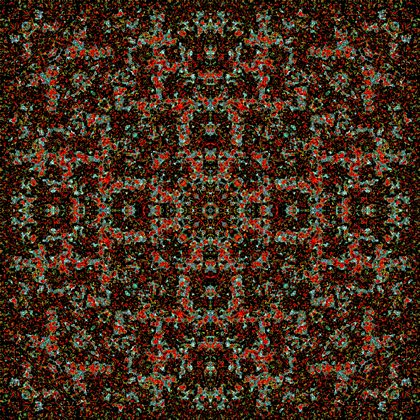](docs/gallery/slices/02.png)
[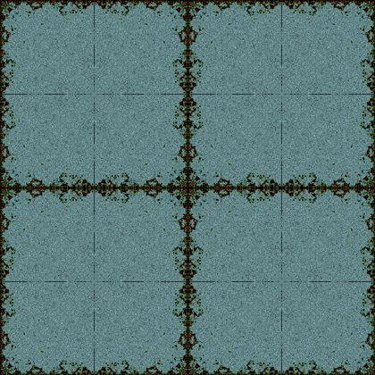](docs/gallery/slices/03.png)
[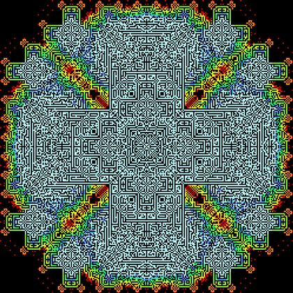](docs/gallery/slices/04.png)
[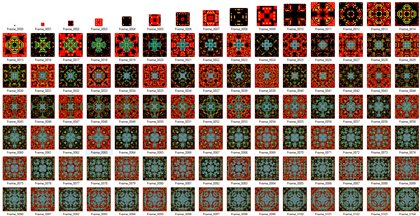](docs/gallery/slices/05.png)
