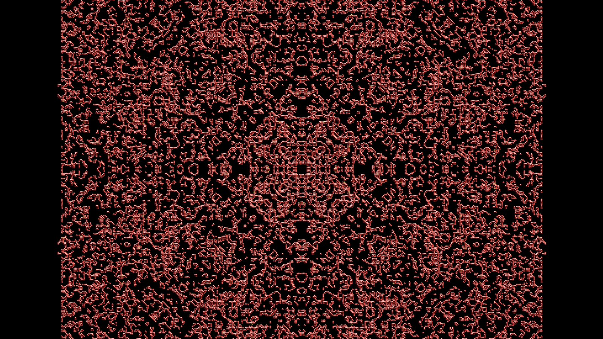
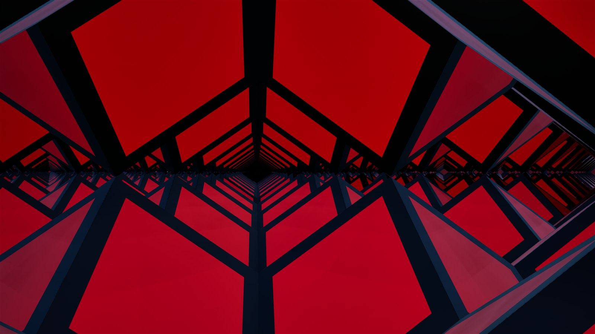
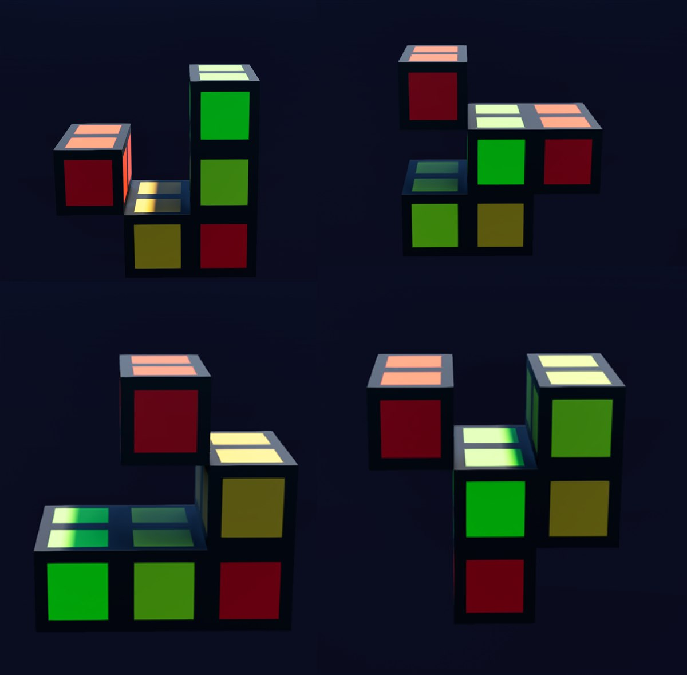

# Cellular Automata — a 3D cellular-automata laboratory on Unreal Engine 5.7

**English** | [Русский](README.ru.md)



A real-time sandbox for exploring three-dimensional cellular automata: seed a pattern, pick a rule, and watch structures grow, glide, decay and collapse — at up to **~7 million live cells in real time**. Everything is built for *examining* what emerges: DCC-style orthographic cameras, cutaway slices, age-based coloring, PNG capture straight from the grid, sonification that lets you *hear* periodicity and collapse before you see them, and a save format for keeping your finds.

| | |
|---|---|
|  |  |
| *Flying inside a grown structure* | *Cells up close — color encodes age* |

## Features

- **Simulation** — chunked bit-packed grid (sparse, origin-centred, negative coordinates are the norm); CPU and GPU (compute shader) strategies; stepping runs off the game thread; multiple generations per rendered frame (`StepsPerRender`); step-backward via deterministic recompute (Ctrl+Z).
- **Rules** — `Survival/Birth/States/Neighborhood` rule strings, a preset library, and Generations-style multi-state decay ("flying rods" and friends). **15 neighborhoods** built from the four distance shells within radius 2, plus an anisotropic planar one.
- **Lattices** — cells don't have to be cubes: five space-filling polyhedra (Fedorov's complete 1885 classification — cube, rhombic dodecahedron, truncated octahedron, elongated dodecahedron; hexagonal prism pending), each with its own mesh and lattice transform. Parity filters turn the cubic lattice into FCC/BCC.
- **Rendering** — one instanced-mesh component, per-instance age/decay color ramps, four render profiles on F1–F4, distance culling, a movable cull volume, view slices, and a surface-only mode that draws a 14M-cell solid as ~350k instances with a pixel-identical picture. Chunked (amortized over frames) rebuilds for huge grids.
- **Editing** — marquee and ray-pick selection (voxel DDA), draw mode with a ghost cursor, clipboard with 90° rotations, a Blender-style array modifier, and an undo journal that survives resets: manual edits are replayed on top of the recomputed trajectory.
- **Generators** — lattices, solids, noise, symmetric seeds; neighbor-count histograms for matching a structure to a rule; auto-reseed search that re-rolls the seed on extinction/stasis/explosion and lets the hunt run unattended.
- **Sonification** — the population curve (in log space) drives a MetaSound graph: slope, curvature and event triggers; the ear catches oscillators and die-offs earlier than the eye.
- **Capture** — orthogonal PNG slices rasterized straight from the grid (no GPU, no resolution limit, F6/F7 for one/series), an F10 photo mode, and a Shift+F10 spherical panorama (six captures stitched to one equirectangular PNG).
- **Persistence** — a `.casave` container: the rule, the *initial* pattern and a thumbnail. Alt+S quick-saves a find to a fresh auto-named file, so a collection of discoveries can never overwrite itself.

## Requirements

- **Windows 10/11** (the project is developed and tested on Windows; there are no known blockers for Linux, but it is unverified)
- **Unreal Engine 5.7** from the Epic Games Launcher
- **Visual Studio 2022** with the *Game development with C++* workload — the repo ships a `.vsconfig`, so VS offers to install any missing components when you open the solution
- ~2 GB of disk for the clone plus UE's usual derived-data cache

## Quick start

```
git clone <this repo>
```

1. Right-click `CellularAutomata.uproject` → **Generate Visual Studio project files** (or run the command below).
2. Open `CellularAutomata.sln`, pick **Development Editor | Win64**, build and run — or just double-click the `.uproject` and agree to compile.
3. The editor opens the default level. Press **Play** (PIE): an initial pattern is generated automatically.
4. Press **Space** — the simulation runs.

Command-line equivalents:

```powershell
# Generate project files
& "C:\Program Files\Epic Games\UE_5.7\Engine\Build\BatchFiles\Build.bat" -projectfiles -project="<repo>\CellularAutomata.uproject" -game -rocket -progress

# Build the editor target
& "C:\Program Files\Epic Games\UE_5.7\Engine\Build\BatchFiles\Build.bat" CellularAutomataEditor Win64 Development -Project="<repo>\CellularAutomata.uproject"
```

## Controls (the essentials)

Every hotkey lives in `Config/DefaultInput.ini` (`CA_*` rows) and can be rebound there; the full annotated list is in [docs/input-and-camera.md](docs/input-and-camera.md).

| Key | Action |
|---|---|
| **Space** | run / pause the simulation |
| **N** | new random seed (Shift+N — auto-reseed search) |
| **R** | reset to the initial pattern |
| **Ctrl+Z** | step backward |
| **Y** | regenerate with the current generator (Ctrl+Y — neighbor histogram) |
| **+/-** | simulation speed · **T / G** — generations per rendered frame |
| **F1–F4** | render profiles · **F5** — HUD info panel |
| **1–0** | age filters |
| **Tab** | selection mode · **Shift+Tab** — draw mode (LMB place, RMB erase) |
| **Enter** | keep only the selection · **Delete** — delete selected cells |
| **Ctrl+C / Ctrl+V** | copy / paste cells (arrows rotate the buffer 90°) |
| **Ctrl+D** | array modifier |
| **F6 / F7** | PNG slice / slice series · **F10** — photo · **Shift+F10** — 360° panorama |
| **Ctrl+S / Ctrl+O** | save / load `.casave` · **Alt+S** — quick-save a find |
| **P** | sonification on/off |
| **NumPad 1–9** | axial / isometric views · **NumPad 5** — orthographic toggle · **Home** — frame all |

## Documentation

The architecture map is [CLAUDE.md](CLAUDE.md); each subsystem has a deep-dive under [`docs/`](docs/) — including measured performance numbers, engine traps, and the approaches that were tried and rejected (the most valuable part: a dead end documented is a dead end not walked twice).

## Tests

A 27-test automation suite covers the actor-free logic (grid math, rule parsing, selection, color ramps — see [docs/testing.md](docs/testing.md)):

```powershell
& "C:\Program Files\Epic Games\UE_5.7\Engine\Binaries\Win64\UnrealEditor-Cmd.exe" "<repo>\CellularAutomata.uproject" -ExecCmds="Automation RunTests CellularAutomata" -testexit="Automation Test Queue Empty" -unattended -nopause -nosplash -abslog=<logfile>
```

## Optional: editor automation via MCP

`Plugins/McpAutomationBridge` (third-party, MIT) exposes the running editor over HTTP for AI-assisted workflows — spawning actors, screenshots, console commands. Entirely optional at runtime; see [docs/tooling.md](docs/tooling.md).

## License

The project is licensed under **[AGPL-3.0](LICENSE)**.

Third-party components keep their own licenses: `Plugins/McpAutomationBridge` — [MIT](Plugins/McpAutomationBridge/LICENSE) (by [ChiR24](https://github.com/ChiR24/Unreal_mcp)); the Exo 2 font — SIL OFL 1.1. The music tracks in `Content/music` are by the project author. Unreal Engine itself is governed by the [Epic Games EULA](https://www.unrealengine.com/eula) — this repository contains no engine code.
